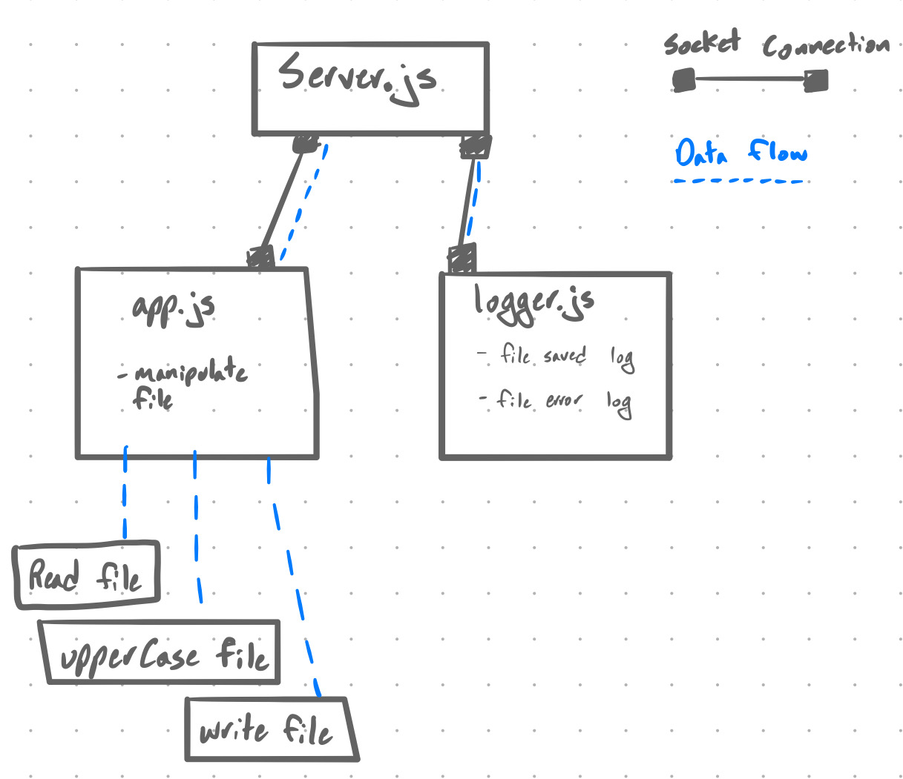

 LAB
=================================================

## TCP Server

### Author: Jagdeep Singh

### Links and Resources
* [submission PR]()

### Setup
#### `.env` requirements
* `PORT` - Port Number, ex 3001

#### Running the app

  
#### Tests
No tests written, haven't gone over how to test sockets.

#### UML

